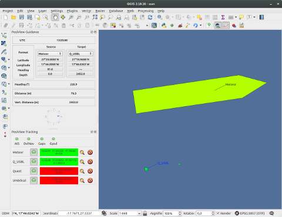

.. PosiView documentation master file, created by
   sphinx-quickstart on Sun Feb 12 17:11:03 2012.
   You can adapt this file completely to your liking, but it should at least
   contain the root `toctree` directive.

PosiView multi vehicle/object tracking tool
============================================

.. _toctree::
   :maxdepth: 2
   
   
     
.. index:: Concpets

Concepts
==================

PosiView is a plugin that allows to track multiple vehicles and objects.
It accepts position and other data usually provided in NMEA-0183 format from devices 
like GPS, USBL systems or other sensors.

Connection to those devices is established by data provider
connecting to network sockets (UDP/TCP) or serial ports. 

To get something up and running just do:

#. Create one or more data provider.
#. Create one or more vehicles and objects and assign a data provider.
#. Start tracking and wait for data.

.. index:: Configuration
 
Configuration
==================

#. Enable PosiView and open configuration dialog.

   .. index:: Provider; creating

#. On Provider page, create and configure providers as needed.

   * Add a new provider first, give it a unique name and select the properties.
   * :doc:`provider`
   * Don't forget to apply the changes.

   |
   
   .. index:: Vehicles; creating

#. On Vehicle/Object page, create and configure a vehicle as needed.

   * Add a new vehicle first, give it a unique name and set the properties.
   * Select a type. For shape types a template shape can be choosen by right clicking on the shape lineedit. If needed, modify the shape by hand.
     A heading of zero points upward.
   * For shape types set the real world size.
   * Select colors for outline, fill and track color.
   * The Z-value defines the vertical painting order.
   * Select a timeout. When no fix is received within that time, the display in the tracking window turns red. 
     An additional notification is displayed in the messagebar when no fix is received within n times the timout.
   * Assign one ore more data providers. If a provider supplies more then one position, a filter is needed. 
     This could be a beacon id or a string. For AIS provider the filter has to be the MMSI.
   * :doc:`vehicle`
   * Don't forget to apply the changes.

   |

   .. index:: Vehicles; testing

#. Apply changes and close dialog. Providers and vehicles will be shown in the tracking window.

   .. index:: Tracking window
   
   .. image:: _static/tracking.png
      :align: center

|

#. Click on the green LED of the provider to see what comes in and what is parsed.

   .. index:: Provider; dump window
   
   .. image:: _static/provider_dump.png
      :align: center

.. index:: Tracking

Tracking
==================

#. Start online tracking. 
#. Open guidance window and select two vehicles/objects to see distances and bearing. A compass is visible if the windows lower edge is pulled down.
   The guidance window allows also to display the position of static targets of a map layer.
   
   Requirements for the targets:
   
   * Layer geometry type is 'POINT' 
   * Layer contains a field 'name'
   * Layer has to be the active (selected) layer. The position display is reset when the active layer changes. The plugin doesn't monitor layer modifications. 

   .. index:: Guidance window
   
   .. image:: _static/guidance.png
      :align: center

#. An additional compass window shows the heading of two vehicles

   .. index:: Compass window
   
   .. image:: _static/compass.png
      :align: center
      
.. index:: Recording

Recording
==================

#. Position and bearing of the vehicles and objects can be recorded to a text file. All objects are merged into one file. A new file is created after 10000 lines 
#. On General page of the properties dialog select a path where to store the files.
#. Recording starts manually or automatically on tracking start.

.. index:: Measuring

Measuring
==================

PosiView provides a simple tool to measure distance and azimuth

* Activate measure tool
* Click on map and keep mouse button pressed
* move the mouse
* release mouse button

.. Indices and tables

==================

* :ref:`genindex`
* :ref:`search`

