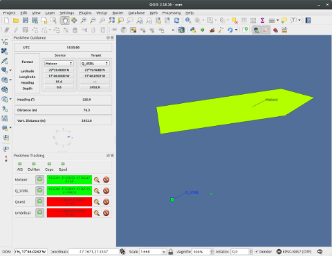

.. PosiView documentation master file, created by
   sphinx-quickstart on Sun Feb 12 17:11:03 2012.
   You can adapt this file completely to your liking, but it should at least
   contain the root `toctree` directive.

============================================
PosiView multi vehicle/object tracking tool
============================================

.. toctree::
   :maxdepth: 2
   :caption: Contents
   :glob:
   :hidden:
   
   provider
   protocol
   vehicle

.. index:: Concpets

|
|

Concepts
==================

PosiView is a plugin that allows you to track multiple vehicles and objects. It processes position and orientation data, typically provided in NMEA-0183 format
by devices such as GPS, USBL systems, or other sensors.
The connection to these devices is established via data providers, which link to network sockets (UDP/TCP) or serial interfaces.

To set up the system, simply follow these steps:

#. Create one or more data providers.
#. Create one or more vehicles and objects and assign one ore more data providers to each.
#. Start tracking and wait for data.

.. index:: Configuration
 
Configuration
==================

#. Activate PosiView and open the configuration dialog.

   .. index:: Provider; creating

#. On the Provider page, create and configure providers as needed.

   * Add a new provider first, assign it a unique name and configure its properties.
   * :doc:`provider`
   * Don't forget to apply the changes.

   |

   .. index:: Vehicles; creating

#. On the Vehicle/Object page, create and configure a vehicle as needed.

   * Add a new vehicle first, assign it a unique name and set its properties.
   * Select a type. For shape types, you can select a template shape by right clicking on the shape lineedit. If necessary, modify the shape manually.
     A heading of zero points upward.
   * Set the real world size for shape types.
   * Select colors for outline, fill and track.
   * The Z-value defines the vertical painting order.
   * Select a timeout. When no fix is received within that time, the display in the tracking window turns red. 
     An additional notification is displayed in the messagebar when no fix is received within n times the timout.
   * Assign one ore more data providers. If a provider supplies more then one position, a filter is needed. 
     This could be a beacon id or a string. For AIS provider the filter has to be the MMSI.
   * Set additional flags, e.g. for ignoring or heading from one provider or processing eating/northing coordinates.
   * :doc:`vehicle`
   * Don't forget to apply the changes.

   |

   .. index:: Vehicles; testing

#. Apply the changes and close the dialogue. The data providers and vehicles are displayed in the tracking window.
#. Start the tracking. The provider LEDs should turn green. If not, the connection cannot be established.
#. The map can be centered on the vehicle. The visible length of the track can be adjusted or the route can be deleted entirely.
   The mouse position is displayed in geographic coordinates here or in the status bar depending on the settings.
   

   .. index:: Tracking window
   
   .. image:: _static/tracking.png
      :align: center

   |

     .. index:: Vehicles; dumping

#. Click on the green LED of the provider to see what comes in and what is parsed.

   .. index:: Provider; dump window
   
   .. image:: _static/provider_dump.png
      :align: center

.. index:: Tracking

Tracking
==================

#. Start online tracking. 
#. Open guidance window and select two vehicles/objects to see distances and bearing. A compass becomes visible if the windows lower edge is pulled down.
   The guidance window allows also to display the position of static targets of a map layer.
   
   Requirements for the targets:
   
   * Layer geometry type is 'POINT' 
   * Layer contains a field 'name'
   * Layer has to be the active (selected) layer. The position display is reset when the active layer changes. The plugin doesn't monitor layer modifications. 

   .. index:: Guidance window
   
   .. image:: _static/guidance.png
      :align: center

#. An additional compass window shows the heading of two vehicles

   .. index:: Compass window
   
   .. image:: _static/compass.png
      :align: center
      
#. Left mouse click on the green tracking display with CTRL-key hold down copies the current vehicle position to the clipboard. The position can 
   also be transferred via drag and drop.

.. index:: Recording

Recording
=========

* Position and bearing of the vehicles and objects can be recorded to a text file. All objects are merged into one file. A new file is created after 10000 lines 
* On the General page of the properties dialog, select a path where to store the files.
* Recording starts manually or automatically on tracking start.

Logging to a layer
==================

* The positions can be recorded in a layer.
* On the Vehicle page, enable "Record to Track Layer". A storage layer will be created (or assigned if it already exists) with the vehicle name and the suffix "_Track".
* Layers are memory layers, meaning they are not saved permanently. It is the user's responsibility to save the layer permanently.
  A good format for this is, for example, "GeoPackage."The layer are memory layer 
* If "Repaint" is enabled, the layer will be redrawn with each new point. This increases CPU load and should only be activated when absolutely necessary.

.. index:: Measuring

Measuring
=========

PosiView provides a simple tool to measure distance and azimuth:

* Activate measure tool
* Click on map and keep mouse button pressed
* Move the mouse
* Holding the CTRL-key down during release, copies the position to the clipboard

Following or Lasso Tool
=======================
This tool "throws" a lasso from one vehicle to another or to any selected point. The distance and bearing then remain constant, and the loop defines a working area relative to the thrower.

* On the General tab, activate "Enable Following Tool". Select a color and up to four "Quick Access Radii" for the Dock window.
* Click on the new button in the toolbar to open the dialog. Select a source vehicle.
* Either select a target vehicle or disable it and click on the map. Distance and bearing is displayed.
* Click "Add Lasso". When the vehicles have valid positions, the lasso is displayed.
* The "Quick Lasso" Pannel allows fast switching between the configured radii or switching it off.

  .. image:: _static/lasso.png
  

.. Indices and tables

==================

* :ref:`genindex`
* :ref:`search`

